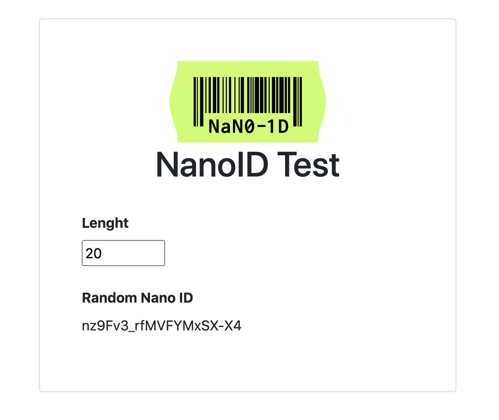

# Test page using skypack

Test page using [skypack](https://www.skypack.dev) to generate random id using [nanoid](https://github.com/ai/nanoid) library.

# How to use?

* Search for npm package [skypack.dev](https://skypack.dev)
* Import script using skypack url in your html page
```
    <script type="module">
        import { nanoid } from 'https://cdn.skypack.dev/nanoid';
        console.log('Random ID', nanoid());
    </script>
```
* Refer to [index.html](https://github.com/mainendra/skypack-app/blob/main/index.html) for sample page using nanoid.

# Outuput (using sample index.html)

Page hosted on [surge.sh](https://m-skypack.surge.sh/)


